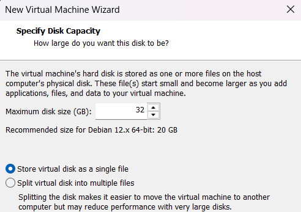
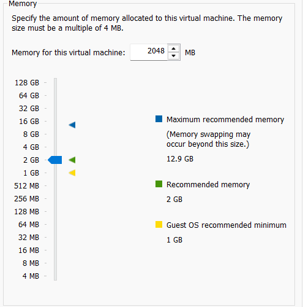
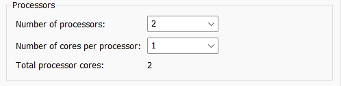
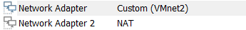
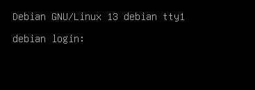

# Holodeck
## Sommaire
1. [objectifs et contexte](#1--mise-en-place-des-vm)
2. [Mise en place des VM](#2-la-mise-en-place-des-deux-vm)
3. [Serveur DHCP et DNS](#3-configuration-dns-et-dhcp)


## 1.  Mise en place des vm
### 1.1 Déploiment d'une Vm serveur et d'une Vm cliente.
Contenant un serveur Web, un serveur ftp tout deux avec un certificat TLS. Ainsi que les serveurs DNS, DHCP qui auront pour domaine starfleet.lan, LDAP, MAriaDB, l'utilisation de PHP pour le serveur web avec ngnix
### 1.2 Les contraintes
- Pas de comptes sudo
- mise en place du par-feu uniquement pour les ports requis
- serveur web avec nginx et ne https
- PHP, MariaDB, et Nginx doivent être la dernière version
## 2. La mise en place des deux VM
### 2.1 Vm serveur 
- 32 Go de stockage
<p align="center">
  
</p>
      
- 2 GO de RAM
<p align="center">
  
</p>

- 2 vCPU
 <p align="center">
  
</p>
     
- 2 cartes réseaux une lan et une wan
  <p align="center">
  
</p>

- VM en CLI
 <p align="center">
  
</p>

### 2.2 VM cliente
- VM en GUI
- 16 Go de stckage 
- carte réseau sur le lan 
## 3. configuration DNS et DHCP
### 3.1 Configuration DHCP

```bash
apt install -y isc-dhcp-server
```
>`/etc/default/isc-dhcp-server` :
```bash
INTERFACESv4="ens33"
```
>`/etc/dhcp/dhcpd.conf` :
```
authoritative;

subnet 192.168.10.0 netmask 255.255.255.0 {
    range 192.168.10.100 192.168.10.200;
    option routers 192.168.10.1;
    option domain-name-servers 192.168.10.1;
    option domain-name "starfleet.lan";
}
```
### 3.2 Serveur DNS 
```bash
apt install -y bind9 bind9utils
```
`/etc/bind/named.conf.local` :
```
zone "starfleet.lan" {
    type master;
    file "/etc/bind/db.starfleet.lan";
};
```
Enregistrements A dans /etc/bind/db.starfleet.lan (ns, www8, www7, php, admin, vscore) pointant vers 192.168.10.1.
`/etc/bind/db.starfleet.lan`
```bash
$TTL    604800
@       IN      SOA     ns.starfleet.lan. admin.starfleet.lan. (
                              1         ; Serial
                         604800         ; Refresh
                          86400         ; Retry
                        2419200         ; Expire
                         604800 )       ; Negative Cache TTL
;
@               IN      NS      ns.starfleet.lan.
ns              IN      A       192.168.10.1
www8            IN      A       192.168.10.1
www7            IN      A       192.168.10.1
php             IN      A       192.168.10.1
admin           IN      A       192.168.10.1
vscore          IN      A       192.168.10.1
```
